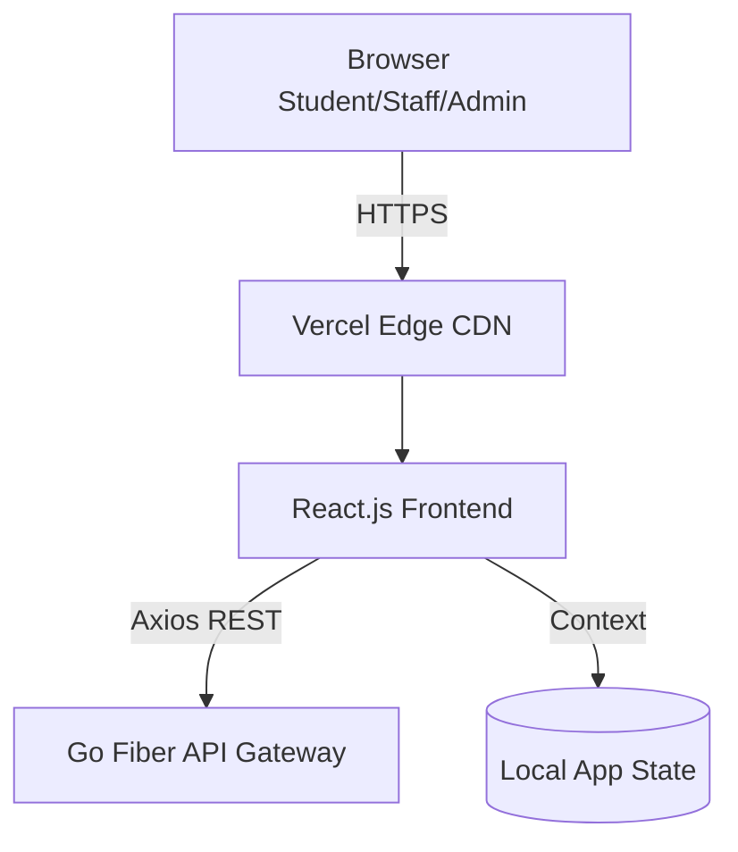

# 🎨 Smart Cafeteria - React Frontend

[](https://react.dev/)
[](https://vitejs.dev/)
[](https://developer.mozilla.org/en-US/docs/Web/CSS)

A premium, responsive web interface for the Smart Cafeteria Management System. Designed for ease of use by students, staff, and administrators — with full **Dark Mode** support.

---

## 📖 1. User Documentation

The platform provides Role-Based Access Control (RBAC) with distinct portals.

### 👨‍🎓 Student Portal
- **Booking Dashboard:** View meal slots, browse the menu, and pre-book meals using an interactive shopping cart. Includes digital token generation (`#13615`).
- **Queue Status:** Real-time view of your queue position and dynamic wait-time calculation.
- **Order Management:** Handle cancellations (`#13736`) directly from the dashboard.
- **Rewards & Incentives:** Earn points for attendance (`#10623`), view incentive status (`#10648`), and redeem free add-ons. 
- **Transparency:** View system service rules (`#13561`) via the Ethics page.

### 👨‍🍳 Staff Portal
- **Queue Manager:** Call tokens sequentially and mark them as served (Enforcing strict FIFO fairness).
- **Demand Forecast:** View AI-predicted student meal volumes to optimize daily food preparation.

### 👑 Admin Portal
- **Analytics Command Center:** Monitor system health, user trends, and fairness indicators (`#13580`).
- **Incentive Configuration:** Define reward rules (`#10618`), prevent abuse (`#10643`), and configure point systems (`#10631`).
- **System Settings:** Manage global application states and operating hours (`#14891`).
- **Security & Ethics:** Full access to fairness audit logs (`#13573`).

---

## 💻 2. Developer Documentation

### Prerequisites
- [Node.js](https://nodejs.org/) (v20+)
- Ensure the Go Backend is running locally on port 5000.

### Local Setup
```bash
# 1. Install dependencies
npm ci

# 2. Run the development server (Defaults to http://localhost:5173)
npm run dev

# 3. Build for production
npm run build
```

### Tech Stack
- **Framework:** React.js 18 built with Vite for rapid HMR.
- **Styling:** Vanilla CSS utilizing CSS Custom Properties for immediate light/dark theme toggling.
- **State:** React Context API (`AuthContext`, `ThemeContext`).
- **Routing:** React Router v6 (Protected Role-based routes).
- **CI/CD:** GitHub Actions `.github/workflows/ci.yml` (Linting, Building, Dockerization).

### Dark Mode Architecture
Dark mode preference is saved to `localStorage` and respects system preferences. CSS variables in `:root` are programmatically overridden by `data-theme="dark"` on the body element.

---

## 🏗️ 3. Architecture Overview



- **Deployment:** The frontend is Dockerized but optimized for deployment on Vercel or similar Edge PaaS.
- **API Integration:** All API calls are centralized in `src/services/api.js`. Axios interceptors automatically attach JWT bearer tokens and handle 401 Unauthorized errors (refresh/redirect).

---

## 🔐 4. Security & Authentication
- **TOTP 2FA:** Setup required for privileged roles (Staff, Admin).
- **Route Guards:** If a student attempts to navigate to `/admin`, the React Router intercepts and redirects to `/unauthorized`.

## 📝 Demo Credentials
| Role     | Email                        | Password  |
|----------|------------------------------|-----------|
| Admin    | admin@cafeteria.com          | admin123  |
| Student  | john.keller@university.edu   | john123   |
| Staff    | staff@cafeteria.com          | staff123  |
